# 🚀 SK네트웍스 Family AI 과정 14기 1팀 - Final Project

## 🔗 운영 사이트: [https://code-nova.dev](https://code-nova.dev)

## **❇️ 프로젝트명 : CodeNova**  
LLM 활용 내부 고객 업무 효율성 향상을 위한 API 전문 사내 개발자 지원 AI 기반 문서 검색 시스템  

---

## 🙌 팀원
- 김준기 · 김재우 · 안윤지 · 이나경 · 이원지희 · 정민영

---

## 📑 목차
- [프로젝트 개요](#toc-overview)
- [시장조사 및 BM](#BM)
- [기술 스택](#toc-tech)
- [시스템 아키텍처](#toc-arch)
- [주요 구성요소](#toc-services)
- [주요 기능](#toc-features)
- [프로젝트 User-Flow](#toc-userflow)
- [AI 모델링](#toc-aimodel)
- [AI 모델 경쟁력 분석](#toc-competitive)
- [사용 데이터](#toc-data)
- [데이터 전처리 과정](#toc-preprocess)
- [ERD](#toc-erd)

## 📌 프로젝트 개요
API 문서는 방대한 문서와 복잡한 구조로 인해 개발자가 필요한 정보를 신속하게 찾기 어렵습니다.  

본 프로젝트는 **RAG + LLM 기반 문서 검색 시스템**을 구축하여 내부 개발자의 **검색 효율성**과 **업무 생산성**을 높이는 것을 목표로 합니다.  

이 시스템은 아래와 같이 크게 **API 전문 어시스턴트**과 **사내 내부 문서 전문 SLLM 챗봇**으로 구성됩니다.  

- **API 전문 어시스턴트**:
  - **OpenAI GPT-4o 기반 챗봇**
  > API Q&A, 예제 코드, 오류 해결 등 **API 문서에 대한 전반적인 질의응답**을 지원하는 챗봇. 사용자가 질문을 입력하면 관련 문서를 벡터 DB에서 검색하여 최적의 답변을 제공합니다.  

  - **API 문서 원문 검색**:  
  > 사용자가 입력한 검색어에 대한 **의미 기반 검색**을 통해 API 문서 원문 링크를 빠르게 찾을 수 있는 기능. 
  > 
  > 사용자가 특정 키워드나 의미를 입력하면 관련 원문 링크를 제공하여 구체적인 정보에 쉽게 접근할 수 있게 합니다.  

- **사내 내부 문서 전문 sLLM 챗봇**:  
  > 사내 정책·규정·기술 자료를 검색할 수 있으며, **권한 기반 보안 필터**를 적용해 사용자의 직급과 부서에 맞는 문서만 열람 가능하도록 합니다.
  >
  > 또한, **사내 전용 말투·용어·보고체계**를 반영하여 내부 직원들이 친숙하고 실질적인 도움을 받을 수 있도록 최적화된 대화 경험 제공합니다.
  > 
  > 그리고 사용자가 공손/친구 말투 중 선택할 수 있도록 하여, 원하는 형태의 챗봇 응답을 받을 수 있도록 하는 사용자 경험을 제공합니다. 

---

## 📊 시장 조사 및 BM

### 시장 규모
- **글로벌 AI 소프트웨어 시장**: 2028년 6,788억 달러 전망  
- **국내 AI 산업**: 2024년 6조 3,000억 원 (응용 소프트웨어 2조 6,700억 원, 최대 비중)

### 타겟 고객
- API(구글 등)를 활용하는 **사내 개발자 / 엔지니어**
- API 연관 서비스 및 연동 솔루션 관련 부서

### 비즈니스 모델 (BM)
- **구독형 라이선스**: 월/연 단위 과금, 기능별·사용자 수 차등 요금제
- **엔터프라이즈 계약**: 맞춤형 데이터 연동, 기술 지원 포함  

---

## ⚙️ 기술 스택

| 항목                  | 내용                                                                                                                                                                                                                                                                                                                                                                                                                                  |
|:--------------------|:------------------------------------------------------------------------------------------------------------------------------------------------------------------------------------------------------------------------------------------------------------------------------------------------------------------------------------------------------------------------------------------------------------------------------------|
| **Frontend**        |     |
| **Backend**         |     |
| **DB**              |                                                                                                                                                                                                                              |
| **Infra**           |       |
| **CI/CD**           |                                                                                                                                                           |
| **Embedding Model** |                                                                                                                                                                                                                                                                                                                          |
| **LLM Model**       |  -FF6F00?style=for-the-badge&logo=alibabacloud&logoColor=white) |
| **Orchestration**   |   |
| **Evaluation**      |  |
| **Collaboration**   |     |
| **Development**     |   |

---

## ⚙️ 시스템 아키텍처

> 
>
> 본 시스템은 Django 기반 웹 애플리케이션, FastAPI 서비스, LLM(OpenAI GPT-4), sLLM(Qwen3-8B 파인튜닝 모델)로 구성됩니다.  
> 
> 대부분의 애플리케이션은 **AWS Elastic Beanstalk** 환경에서 **Docker 컨테이너** 형태로 배포됩니다.  
> 
> 다만, **MySQL DB는 별도의 AWS EC2 인스턴스** 위에서 Docker 컨테이너로 운영됩니다.  

---

### 🔹 주요 구성 요소

1. **웹 애플리케이션 계층**
   - **Django (Gunicorn/Uvicorn)**: 메인 백엔드 프레임워크, OpenAI GPT-4 API 연동
   - **Nginx Proxy + Application Load Balancer (ALB)**: 외부 요청을 HTTPS/HTTP로 수신 후 Django 컨테이너로 전달
   - **AWS Route53**: 도메인 관리 및 HTTPS 라우팅 (`https://code-nova.dev`, `http://sllm.code-nova.site`)

2. **데이터베이스 계층**
   - **MySQL (별도 AWS EC2 인스턴스 내 Docker 컨테이너)**: 사용자 계정 정보, 채팅 내역, 커뮤니티 내용 등 저장
   - **Chroma Vector DB**: 챗봇 RAG 검색용 벡터 데이터베이스

3. **스토리지 계층**
   - **AWS S3**: 채팅 이미지, 프로필 이미지 파일 저장소

4. **AI 모델 계층**
   - **LLM (OpenAI GPT-4)**: 주 대화 모델로서 범용적인 질의응답 처리
   - **sLLM (Qwen3-8B Fine-tuned, RunPod + vLLM)**: 파인튜닝된 도메인 특화 모델, RunPod GPU 환경에서 vLLM을 통해 서빙  
   - **FastAPI 서비스**: sLLM inference API 제공 (Nginx Proxy와 연동)

5. **CI/CD 파이프라인**
   - **GitHub → DockerHub → AWS EB**
   - 로컬 개발(예: PyCharm) 후 GitHub에 Push
   - `main` 브랜치 Merge 시 **GitHub Actions**가 Docker Image를 빌드 및 DockerHub에 업로드
   - Elastic Beanstalk이 최신 이미지를 Pull 받아 자동 배포

---

## ✔️ 주요 기능

### **🌎 구글 API 전문 어시스턴트**

- **OpenAI GPT-4 기반 멀티모달 챗봇**:

  > 구글 API Q&A, 예제 코드, 오류 해결 등 **구글 API 문서 전반에 대한 질의응답**을 지원합니다. 
  > 
  > 텍스트 입력뿐 아니라 **오류 코드 스니펫**이나 **API 관련 캡처 이미지**도 인식하여, **API 사용법 / 오류 해결법 / 예시 코드**를 함께 제공합니다.
  >
  > 
  >
  > 또한 **이전 대화 맥락**을 반영하여 연속적인 대화에서도 정확한 답변을 유지합니다.
  >
  > 

- **API 질문 분기 처리**:
  > 입력된 질문 유형에 따라 효율적으로 분기 처리합니다.  
  >
  > ◆ **API 관련 질문** → 문서 검색 + GPT-4 기반 응답
  > 
  > 
  > 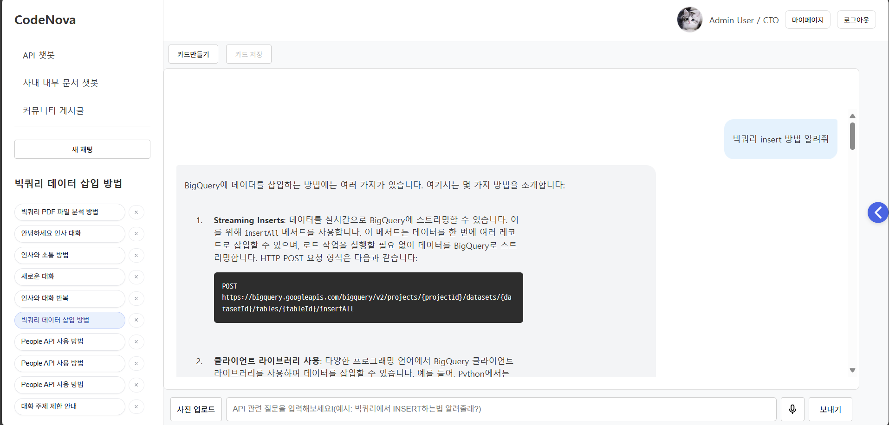
  >
  > ◆ **일상 대화** → 일반 대화 모드로 응답
  > 
  > 
  > 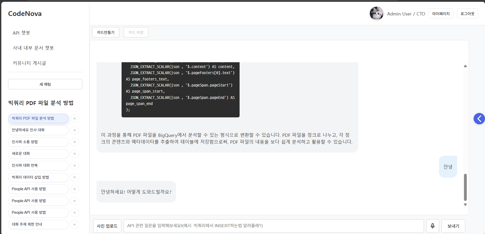
  > ◆ **지원하지 않는 질문(예: GitFlow, 사내 업무 질문 등)** → "지원 범위 외 질문"으로 안내  
  > 
  > 
  > 

- **음성 입력 지원 (Whisper 연동)**:  
  > OpenAI **Whisper 모델**을 연동하여, 사용자의 **음성 입력을 실시간으로 텍스트 변환**하고  
  > 변환된 내용을 기반으로 질의응답을 수행합니다.
  > 
  > 

- **구글 API 문서 검색 기능**:  
  > **유사도 기반 검색**을 통해 관련된 문서 원문을 빠르게 찾아 원문 링크를 보여줍니다.
  > 
  > 검색된 문서 중 **가장 유사도가 높은 Top N개 문서**를 사용자에게 제공하며, **N 값은 사용자가 직접 조절 가능**합니다.  
  > 
  > 또한 관련 원문 링크를 함께 제공하여, 세부 정보를 쉽게 확인할 수 있도록 지원합니다.
  > 
  > 

### **🧑‍💼 사내 문서 sLLM 챗봇**

- **모델 및 학습 특성**:  
  > **Qwen3-8B 모델**을 **LoRA 방식으로 파인튜닝**하여 구축된 챗봇입니다.
  > 
  > 학습 과정에서 **일상 대화**, **문서 검색 질의응답(RAG)**, 말투(공손/반말)뿐만 아니라, **멀티턴 TOOL CALL 패턴**까지 반영하여, 대화 맥락을 고려한 자연스러운 응답이 가능합니다.  
  > 
  > 추가로, 사용자가 원하는 말투를 선택할 수 있도록 지원합니다.  

- **내부 문서 검색 및 응답**:  
  > **사내 문서 검색**과 관련된 질문은 **RAG 기반 검색**을 통해 정확한 답변을 제공합니다.  
  >  
  > 이 과정에서 **직급 및 권한에 따른 문서 접근 제어** (벡터 db 분리 및 tool 제한)를 적용해 보안이 강화된 검색 환경을 보장합니다.
  > 
  > 아래는 프론트엔드팀원이 백엔드 문서에 접근할 수 없고, 프론트엔드 문서만 접근할 수 있는 실제 예시 이미지입니다.
  > 
  > 

- **일상 대화 응답**:  
  > 사내 문서 검색 이외의 **일상 질문**에 대해서는, 파인튜닝된 **Qwen3-8B 모델 자체**의 대화 능력을 활용하여 응답합니다.
  > 
  > 

- **커뮤니케이션 톤**:  
  > **사내 말투와 용어**를 반영해 조직 내부 커뮤니케이션에 맞는 톤과 스타일로 응답하며,  
  >
  > 사용자 선택에 따라 **공손한 말투**와 **친구 말투 톤** 모두 자연스럽게 지원합니다.
  > 
  > 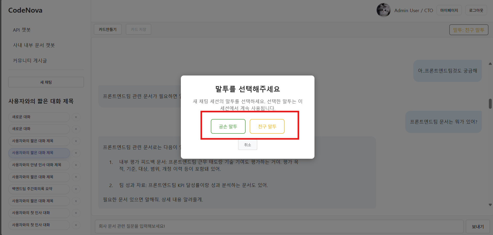
  > 
  > ◆ 공손한 말투 예시
  > 
  > 
  > 
  > 
  > ◆ 친구 말투 예시
  > 
  > 
  > 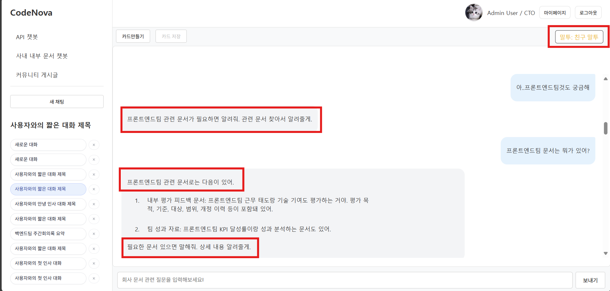

---

### **⚙️ 부가기능**

- **대화 카드 저장**:  
  > 팀 내에서 중요한 **코드 자산**이나 **API 사용 예시** 등을 **대화 카드**로 저장할 수 있습니다.
  > 
  > 
  > 
  > 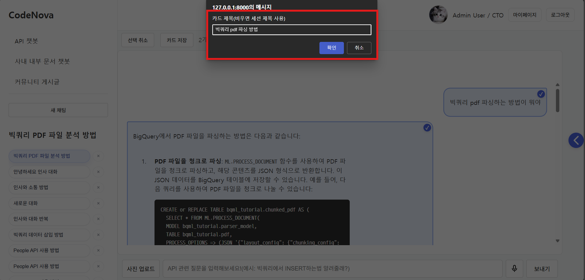
  > 
  > 저장된 카드는 **마이페이지에서 확인 가능**하며, **자세히 보기** 기능을 통해서 저장한 대화 내용을 확인할 수 있고, **채팅 보러가기** 기능을 통해 해당 카드가 속한 대화 세션으로 바로 이동할 수 있습니다.  
  > 
  > 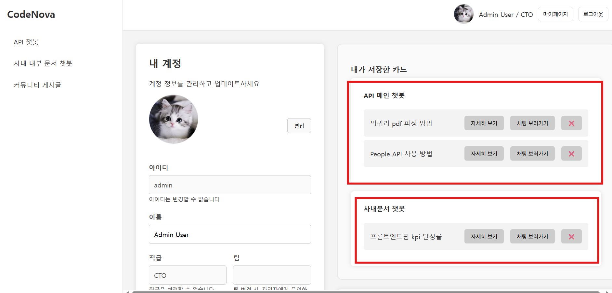
  > 
  > 
  > 
  > 이를 통해 팀 내 지식 관리와 코드 자산 공유가 촉진되어 업무 효율성을 높입니다.  

- **API 키 관리**:  
  > API 키를 **저장, 수정, 삭제, 복사**할 수 있는 기능으로, 사용자는 자신의 API 키를 손쉽게 관리할 수 있습니다.
  > 
  > 

- **커뮤니티**:  
  > 사용자들이 **코드 예제, API 사용법, 문제 해결**뿐 아니라 **일상적인 주제**에 대해서도 자유롭게 의견을 나눌 수 있는 커뮤니티 기능을 제공합니다.
  > 
  > 이를 통해 개발자 간의 정보 공유는 물론, 친목 도모와 소통의 장으로도 활용할 수 있습니다.  
  > 
  > 커뮤니티 내 **베스트 게시글**은 별도로 선별되어 게시판 상단에 노출됩니다.

---

## ♒ 프로젝트 User-Flow

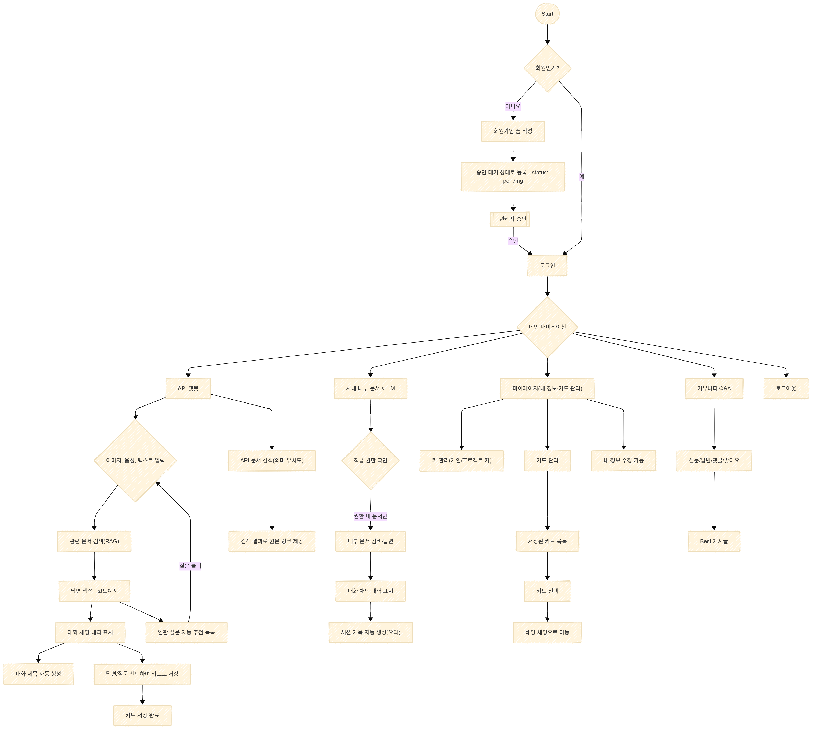

### 🧭 유저 플로우 정리

1. **회원가입 및 승인**
   - 신규 유저는 회원가입 후 `status: pending` 상태로 등록
   - 관리자가 승인해야 로그인 가능

2. **메인 내비게이션: 로그인 후 유저는 네 가지 주요 기능을 이용할 수 있음**
   - **API 챗봇 (API Q&A)**
   - **사내 문서 검색 sLLM**
   - **마이페이지 (키 관리 / 카드 관리 / 내 정보 수정)**
   - **커뮤니티 Q&A**

3. **API 챗봇 (API Q&A)**
   - 입력: 이미지 / 음성 / 텍스트
   - 관련 문서 검색 (RAG) 및 응답 생성
   - 답변 생성 후 대화 내용 표시
   - 유저가 원하는 경우 **대화 카드 저장** 가능
   - 저장된 카드는 마이페이지에서 확인 및 재접속 가능

4. **API 원문 링크 검색**
   - 입력: 텍스트
   - 유사도 기반으로 원문 링크 검색 기능 제공 (검색어 입력 시 관련 원문 링크 제공)
   - 검색된 원문 링크 클릭 시, 해당 원문 사이트로 바로 이동

5. **사내 문서 검색 sLLM**
   - 직급 및 권한 확인 후 문서 검색 가능
   - RAG 기반 문서 답변 및 대화 내용 표시
   - 필요 시 **대화 카드 자동 저장** 기능 지원

6. **마이페이지**
   - **API 키 관리** (등록 / 수정 / 삭제 / 복사)
   - **대화 카드 관리** (목록 확인, 선택 시 해당 세션으로 이동)
   - **내 정보 수정** 가능

7. **커뮤니티 Q&A**
   - 질문, 답변, 댓글, 좋아요 기능 제공
   - **베스트 게시글**은 커뮤니티 상단에 노출
   - 개발/코드뿐 아니라 **일상 관련 주제**도 지원 → 친목 도모 가능

---

## 🔍 AI 모델링

### ① 사내 문서 기반 RAG: Qwen 모델(LoRA 파인튜닝)

### 개요

| 항목 | 내용                                                                                           |
|---|----------------------------------------------------------------------------------------------|
| 목적 | 사내 문서 기반 챗봇용 소형 LLM 파인튜닝 (업무/일상 통합)                                                          |
| 대상 모델 | Qwen3-8B(메인), Qwen2.5-7B-Instruct(비교)                                                        |
| 데이터 | `qwen3_company_train_dataset_combined.json` (팀별: Backend/Frontend/Data_AI/CTO, 말투: 공손/친구 말투) |

### 학습 설정

| 항목 | 값 |
|---|---|
| 하이퍼파라미터 | epochs=3, per_device_train_batch_size=4, grad_accum=2, lr=1e-4, optimizer=adamw_torch_fused, dtype=bfloat16, max_len=8192 |
| LoRA | alpha=32, dropout=0.1, rank=8, target=["q_proj","v_proj"], bias=none |
| 최적화 | gradient_checkpointing=True, grad_clip=0.3, warmup_ratio=0.03, scheduler=constant |
| 모니터링/출력 | log_every=10 steps, save_every=50 steps, output_dir=`qwen3-8b-informal-formal` |
| 전처리 | Qwen chat 템플릿, assistant 응답만 라벨링, 배치 최대 길이 패딩, 토큰 최대 8192 |

### 성능 평가

- **멀티턴 TOOL CALL 성능 평가**

> #### 평가 기준

| 지표 | 목표 | 계산 | 해석 |
|---|---|---|---|
| tool_selection | 정답과 예측의 TOOL NAME 일치 여부 평가 | 정답에 tool_call 있는 샘플 중, 예측이 맞은 개수 / 총 샘플 수 | 정확한 도구를 선택했는지 평가 |
| params_selection | 파라미터 키(TOOL CALL의 키) 일치 정도 평가 | 정답 키와 예측 키의 매칭 수 / (정답 키 수 + 예측에만 있는 키 수) | 필요한 키를 정확히 선택했고 불필요한 키를 추가하지 않았는지 평가 |
| params_value_similarity | 공통 키의 값 유사도 평가 | 형태소 Jaccard(0.6) + 문자 유사도(0.4)의 평균 유사도 | 선택된 값(TOOL CALL 키의 값)들이 얼마나 정확히 일치하는지 평가 |

> #### 평가 결과

| 모델 | tool_selection | params_selection | params_value_similarity |
|---|---:|---:|---:|
| Qwen3-8B (기본) | 79.22% | 79.22% | 77.21% |
| Qwen2.5-7B (기본) | 25.97% | 25.97% | 67.33% |
| Qwen3-8B (파인튜닝) | 98.05% | 98.05% | 88.50% |
| Qwen2.5-7B (파인튜닝) | 99.68% | 99.68% | 87.55% |

- **RAGAS 평가 (LLM+자체 데이터셋 55개)**

> #### 평가 기준

| 지표 | 설명 |
|---|---|
| Context Recall | 검색된 문맥이 질문과 기준 정답을 얼마나 잘 포괄하는지 |
| Faithfulness | 생성된 답변이 검색된 문맥에 얼마나 충실한지 |
| Factual Correctness (mode = f1) | 생성된 답변이 기준 정답과 의미적으로 얼마나 일치하는지 (F1 스코어 기반) |

> #### 평가 결과
| 모델 | context_recall | faithfulness | factual_correctness(f1) |
|---|---:|---:|---:|
| Qwen2.5-7B (파인튜닝) | 0.7697 | 0.7992 | 0.3191 |
| Qwen3-8B (파인튜닝) | 0.9273 | 0.8614 | 0.3709 |

- **자체 정량 RAG 평가**

> #### 평가 기준

| 지표 | 정의 | 점수(0~3) | 100점 환산 |
|---|---|---:|---|
| 정확도 (Accuracy) | 시스템 답변이 기준 정답과 얼마나 일치하는지 | 0~3 | (정확도 점수 / 3) × 100 |
| 재현율 (Recall) | 기준 정답의 중요한 정보를 얼마나 재현했는지 | 0~3 | (재현율 점수 / 3) × 100 |
| 구체성 (Specificity) | 세부 사항을 얼마나 구체적으로 설명했는지 | 0~3 | (구체성 점수 / 3) × 100 |

> #### 평가 결과

| 모델 | 정확도 | 재현율 | 구체성 | 평균 |
|---|---:|---:|---:|---:|
| Qwen2.5-7B (파인튜닝) | 67.27 | 70.91 | 55.76 | 64.65 |
| Qwen3-8B (파인튜닝) | 70.91 | 74.55 | 65.45 | 70.30 |

- **벡터 DB 검색 TOP_K 테스트(LLM 기반 정량적 RAG 평가)**

> #### 평가 기준

| 항목 | 목표 | 기준 | 100점 환산 |
|---|---|---|---|
| 정확도 (Accuracy) | 시스템 답변이 기준 정답과 얼마나 일치하는지 | 3점: 완벽 일치 2점: 약간 차이 1점: 핵심 맞지만 세부 누락 0점: 큰 차이 | (점수 / 3) * 100 |
| 재현율 (Recall) | 기준 정답의 중요한 정보를 얼마나 잘 재현했는지 | 3점: 모든 핵심 정보 재현 2점: 핵심 정보 재현, 세부 부족 1점: 핵심 정보 누락 0점: 많이 누락 | (점수 / 3) * 100 |
| 구체성 (Specificity) | 세부 사항(매개변수, 예시 등)을 얼마나 구체적으로 설명했는지 | 3점: 구체적 설명 및 예시 포함 2점: 매개변수 설명, 예시 부족 1점: 기본 설명만 0점: 세부 누락 | (점수 / 3) * 100 |
| 최종 평균 점수 | 정확도+재현율+구체성의 평균 | - | (정확도+재현율+구체성) / 3 |

> #### 평가 결과

| TOP_K 값 | 평균 정확도 | 평균 재현율 | 평균 구체성 | 전체 평균 |
|---------|---:|---:|---:|---:|
| 4       | 70.30 | 74.55 | 63.64 | 69.49 |
| 5       | 71.52 | 75.76 | 65.45 | 70.91 |
| 6       | 70.91 | 73.94 | 64.24 | 69.70 |
| **7**       | **71.52** | **77.58** | **68.48** | **72.53** |
| 8       | 63.64 | 69.70 | 63.64 | 65.66 |

> 결론: k=7일 때 가장 높은 평균 성능(72.53)을 기록하였으며, 벡터 DB 유사도 검색 시 최적의 k 값은 7로 판단됨.

### 기술적 특징 및 결론
- **기술**: bfloat16, Gradient Checkpointing, LoRA, Chat 템플릿, TOOL CALL/RESPONSE 구조, 팀별 특화 검색 도구
- **대화 처리**: 시스템/사용자 메시지 구분
- **도구 호출**: 문서 검색 기반 정확한 답변 생성
- **성과 분석**: 베이스 대비 TOOL CALL 대폭 개선(Qwen2.5-7B: +73.71%p, Qwen3-8B: +18.83%p). 파인튜닝 후 Qwen2.5-7B는 tool_selection 1%p 높고, Qwen3-8B는 value_similarity 1%p 높음
- **최종 선정**: RAG 전반 우수한 Qwen3-8B 파인튜닝 모델
- **활용**: 팀별 특화 문서 검색, 정확한 RAG 업무 답변, 일상 대화 활용
- **개선 방향**: 질문 유형 확대, 실시간 문서 업데이트 반영, 사용자 피드백 기반 개선

## ② LangGraph 기반 멀티모달 RAG 챗봇: GPT-4 + 하이브리드 검색

### 개요

| 항목 | 내용 |
|---|---|
| 모델 | GPT-4(4o, 4o-mini 혼합, OpenAI API) |
| 목적 | 구글 API 문서 기반 멀티모달 질의응답 |
| 선정 이유 | 멀티모달 강점, JSON 모드/함수호출로 구조화 출력, temperature=0 재현성, OpenAI 생태계 호환, 4o-mini로 비용/지연 최적화, 엔터프라이즈 적합성 |

### 아키텍처/흐름

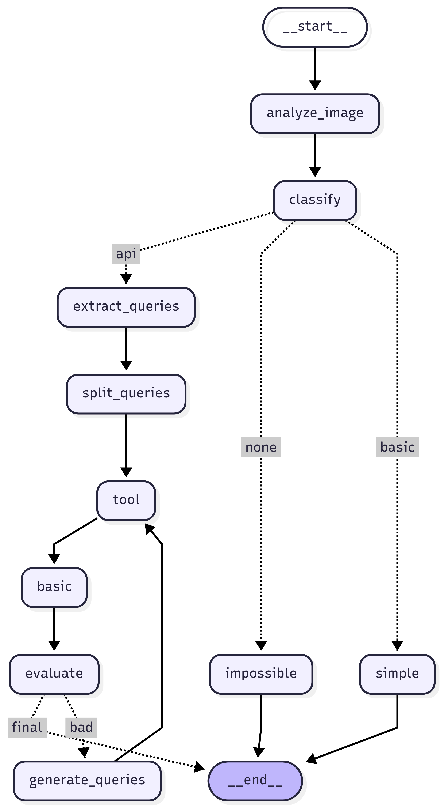

| 항목 | 내용 |
|---|---|
| 워크플로우 | 이미지 분석 → 질문 분류(api/basic/none) → 쿼리 추출/분리 → LLM 툴 호출 → 하이브리드 검색 → 답변 생성 → 품질 평가 → (bad 시) 재검색 후 재답변 |
| 검색 | Chroma + BGE-m3(가중 0.8, normalize=True) + BM25(가중 0.2), 태그별 BM25 인덱스 캐싱(pkl) |
| 재시도 전략 | 초기(text_k=5, qa_k=20) → 재검색(text_k=15, qa_k=30) |

### 주요 설정

| 항목 | 값 |
|---|---|
| 메인/분류/추출 | GPT-4o(temperature=0), 쿼리 추출은 JSON 모드 |
| 품질 평가 | GPT-4.1(temperature=0) |
| 임베딩/저장소 | BAAI/bge-m3 + Chroma(원문/QA) |
| 최대 재시도 | 1회 |
| 메모리/히스토리 | MemorySaver, 최근 4개 메시지 유지 |
| 지원 API | 구글 API 11개 태그 |

### 세부 기능

| 기능 | 설명 |
|---|---|
| 멀티모달 | 이미지 자동 분석·텍스트 통합, 이미지-텍스트 연관 질의 처리, S3 이미지 저장/URL 관리 |
| 지능형 검색 | LLM이 적절한 API 태그를 자동 선택하여 검색 |
| 품질 보장 | good/bad 평가, 부정적/회피적 답변 감지, 대체 쿼리 생성 및 재검색 |

### LangGraph 구조 변경사항 / 성능 테스트

| 버전 | Context Recall | Faithfulness | Factual Correctness | 특징 |
|---|---:|---:|---:|---|
| VER-1 | 0.6520 | 0.7354 | 0.4940 | 기본 RAG 구조 |
| VER-2 | 0.6422 | 0.7623 | 0.4837 | 쿼리 분리 추가 |
| VER-3 | 0.6617 | 0.8071 | 0.5150 | 쿼리 분리 최적화 |
| VER-4 | 0.4950 | 0.6062 | 0.3940 | 멀티모달 + 분류 |
| VER-5 | 0.9000 | 0.9274 | 0.6940 | 최종 완성 모델 |

- **최종 성능 요약(VER-5)**: Context Recall=0.9000, Faithfulness=0.9274, Factual Correctness=0.6940
- **운영 적용**: Django 웹앱 통합 완료(`apichat` 앱 `utils` 모듈), 실시간 대화형 인터페이스 제공

### 향후 개선
- **검색**: 시맨틱 캐시, Cross-encoder 리랭킹, 다국어 쿼리
- **워크플로우**: 코드 생성 전용 노드 분기, API 테스트 결과 연동

### 참고/링크
- 학습 로그: Qwen3-8B / QWEN2.5-7B (LoRA 학습 로그)
- 전체 파인튜닝 데이터/스크립트: [GitHub 링크](https://github.com/skn-ai14-250409/SKN14-Final-1Team-AI/tree/docs/SLLM_FINETUNING/250919)
- 학습된 모델(Hugging Face): [Qwen2.5-7B](https://huggingface.co/SKN14-Final-1Team/qwen2.5-7b-informal-formal-merged-09-19), [Qwen3-8B](https://huggingface.co/SKN14-Final-1Team/qwen3-8b-informal-formal-merged-09-19)
- API 챗봇 LLM LangGraph 소프트웨어(Django 내): [GitHub 링크](https://github.com/skn-ai14-250409/SKN14-Final-1Team-Web/tree/develop/apichat/utils)
- API 챗봇 LLM LangGraph 버전별 테스트 코드: 정리 후 첨부 예정

---

## 🏆 AI 모델 경쟁력 분석

### **📊 LangGraph RAG vs Perplexity 비교 평가**

본 프로젝트에서 구축한 **LangGraph 기반 RAG 시스템**과 **Perplexity 모델**을 동일한 데이터셋으로 비교 평가한 결과, **우리 시스템이 Perplexity 대비 우수한 성능**을 보임을 확인했습니다.

#### **🔍 평가 방법론**

- **평가 데이터셋**: 20개 Google API 관련 질문-답변 쌍
- **평가 기준**: 정확도(Accuracy), 재현율(Recall), 신뢰성(Reliability) 3가지 지표
- **평가 방식**: GPT-4.1을 활용한 정성적 평가 (각 지표별 0-3점 척도)
- **비교 대상**: 
  - **우리 시스템**: LangGraph 기반 멀티모달 RAG (GPT-4o + 하이브리드 검색)
  - **Perplexity**: Perplexity Sonar 모델

#### **📈 평가 결과**

| 평가 지표 | **LangGraph RAG** | **Perplexity** | **성능 차이** |
|:---------|:------------------|:---------------|:-------------|
| **정확도 (Accuracy)** | **83.33%** | 66.67% | **+16.66%p** |
| **재현율 (Recall)** | **76.67%** | 58.33% | **+18.34%p** |
| **신뢰성 (Reliability)** | **61.67%** | 33.33% | **+28.34%p** |
| **전체 평균** | **73.89%** | 52.78% | **+21.11%p** |

#### **🎯 주요 성과**

1. **정확도 우위**: 우리 시스템이 Perplexity 대비 **16.66%p 높은 정확도** 달성
2. **재현율 우위**: 핵심 정보 누락 없이 **18.34%p 높은 재현율** 보임
3. **신뢰성 우위**: 기준 정답에 충실한 답변으로 **28.34%p 높은 신뢰성** 확보
4. **종합 성능**: **전체 평균 21.11%p 우수한 성능**으로 Perplexity 대비 명확한 경쟁력 입증

#### **💡 성능 우위 요인**

1. **하이브리드 검색**: BGE-M3 + BM25 조합으로 정확한 문서 검색
2. **품질 보장 메커니즘**: 자동 품질 평가 및 재검색 시스템
4. **도메인 특화 RAG**: Google API 문서 원문/QA셋을 벡터 DB에 넣고, 해당 내용 기반 정확한 RAG 답변

#### **🔬 평가 세부 분석**

- **우리 시스템 강점**:
  - API 문서 기반 정확한 정보 제공
  - 코드 예시와 구체적인 사용법 포함
  - 일관된 답변 품질 유지
  - 도메인 특화 지식 활용

- **Perplexity 한계**:
  - 일반적인 웹 정보 기반 답변으로 정확도 제한
  - API 특화 정보 부족
  - 일관성 있는 답변 품질 유지 어려움

### **🚀 경쟁력 결론**

본 프로젝트의 **LangGraph 기반 RAG 시스템**은 Perplexity 대비 **21.11%p 높은 종합 RAG 성능**을 달성하여, **API 전문 어시스턴트로서 명확한 경쟁 우위**를 보입니다. 특히 **신뢰성에서 28.34%p의 큰 격차**를 보이며, API 문서 기반 정확한 정보 제공에 최적화된 시스템임을 입증했습니다.

---

## 📂 사용 데이터

### **🌐 외부 데이터**

#### **Google API 공식 문서**
| 항목           | 내용 |
|:-------------|:-----|
| **API 종류**   | Drive, Sheets, Gmail, Maps, YouTube, Firebase, BigQuery 등 **총 11개 API** |
| **수집 방식**    | 웹 크롤링 → 텍스트 추출 → 텍스트 파일 저장 |
| **내용**       | 구글의 각종 API 공식 문서에서 필요한 데이터를 크롤링하여 수집. 각 문서의 구조와 내용에 맞춰 텍스트를 추출하고, 각 API 문서가 담고 있는 사용법, 예제 코드, 오류 해결법 등을 포함 |
| **수집 데이터 양** | **총 2,000개 이상의 문서** (txt 형식) |
| **수집한 API**  | BigQuery, Maps API, Firebase Firestore, Firebase Authentication, Drive API, Gmail API, YouTube API, Calendar API, People API, Sheets API, Google Identity |

#### **Google API QA 문서**
| 항목 | 내용                                                                                                      |
|:-----|:--------------------------------------------------------------------------------------------------------|
| **수집 방식** | 수집된 구글 API 문서를 기반으로 GPT-4o-mini를 활용한 Q&A 데이터셋 생성 (질문과 답변을 추출하여 JSONL 형식으로 저장)                           |
| **내용** | 각 API 문서에서 중요한 정보나 사용자들이 실제로 물어볼 수 있는 질문을 기반으로 **QA셋**을 생성. 이 데이터셋은 API 사용법, 오류 해결 방안, 코드 예시 등을 중심으로 구성 |
| **수집 데이터 양** | **총 11개 API별 QA 데이터셋** (JSONL 형식) • 총 QA 데이터: **14,858개**                                           |

### **🏢 내부 데이터**

#### **사내 정책/규정 문서**
| 항목 | 내용                                                                                                                                                                                                                                     |
|:-----|:---------------------------------------------------------------------------------------------------------------------------------------------------------------------------------------------------------------------------------------|
| **수집 방식** | OpenAI GPT-4o API 프롬프트 합성 → 텍스트 파일 저장                                                                                                                                                                                                  |
| **내용** | 사내 정책, 규정, 기술 매뉴얼 등 사내 문서들을 프롬프트 합성을 통해 생성하여 수집. 각 팀/직급별(DATA AI팀, 프론트엔드팀, 백엔드팀, CTO)로 문서 구조와 내용이 달라지며, 이를 바탕으로 텍스트 파일을 생성                                                                                                             |
| **수집 데이터 양** | **팀별 15개씩 총 60개 문서** (txt 형식)                                                                                                                                                                                                          |
| **팀별 문서** | • **Backend 팀**: 15개 문서 (서비스 아키텍처, 보안 인증, 에러 핸들링, 배포 운영 등) • **Frontend 팀**: 15개 문서 (UI/UX 가이드, 컴포넌트 설계, 성능 최적화 등) • **Data & AI 팀**: 15개 문서 (데이터 파이프라인, ML 모델 관리, 분석 도구 등) • **CTO 전용**: 15개 문서 (기술 전략, 아키텍처 설계, 기술 표준 등) |

#### **sLLM 파인튜닝 학습 데이터**
| 항목 | 내용                                                                                                                                           |
|:-----|:---------------------------------------------------------------------------------------------------------------------------------------------|
| **수집 방식** | 사내 문서 기반 초기 질문 생성 → GPT-4o를 활용한 멀티턴 대화 데이터 생성                                                                                                |
| **내용** | 업무 관련 질문과 일상 질문을 포함한 멀티턴 대화 데이터. TOOL CALL/RESPONSE 구조를 포함한 복합적인 대화 패턴 학습                                                                    |
| **수집 데이터 양** | **총 2,368개 대화 데이터** (JSON 형식)                                                                                                                |
| **데이터 특성** | • **팀별 분포**: Backend, Frontend, Data_AI, CTO (거의 동일 비중) • **말투 변형**: 정중체와 반말체 각각 생성 (동일 비중) • **질문 유형**: 업무 관련 질문 : 일상 질문 = 2 : 1 비율 |

---

## 🔄 데이터 전처리 과정

### **📋 전처리 개요**

| 데이터 유형 | 설명 |
|:-----------|:-----|
| **LLM RAG용 데이터** | Google API 문서 기반 QA 데이터셋 생성 |
| **sLLM 파인튜닝용 데이터** | 사내 문서 기반 멀티턴 대화 데이터 생성 |

### **🌐 LLM RAG용 데이터 전처리**

#### **Google API 문서 QA셋 생성**

| 단계 | 처리 과정 | 세부 내용 |
|:-----|:---------|:---------|
| **1단계** | **문서 순회** | 구글 API 문서(txt)들을 하나씩 순회하며 전처리 대상 문서를 불러옴 |
| **2단계** | **문서 분할** | 문서를 900토큰 단위로 나누고, 150토큰 오버랩을 적용하여 중요한 내용이 잘리지 않도록 처리 |
| **3단계** | **페어 단위 Q&A 생성** | 문서 내에서 청크 2개씩 묶어 페어 단위로 질문과 답변을 생성하여, 정보 누락을 최소화하고 문맥 연결을 강화 |
| **4단계** | **유효 Q&A만 저장** | 문서 내 정보에 근거한 질문만 생성하고, Q&A가 생성되지 않으면 해당 항목을 건너뛰는 방식을 적용 |
| **5단계** | **프롬프트 강화** | • **코드 포함 규칙**: 문서에 코드가 있을 경우 답변에 반드시 코드 블록을 포함하도록 하고, 문서에 있는 코드만 사용하도록 제한 • **중복 질문 억제**: 이전에 생성한 질문 목록을 프롬프트에 함께 전달하여, 동일 문서 또는 인접 청크에서 중복 질문 생성을 억제 |
| **6단계** | **메타데이터 저장** | • API 크롤링된 문서의 폴더명에서 API 종류를 추출하여 `tags`로 메타 데이터 저장 • QA셋이 만들어진 원문 파일명을 `source_file`로 메타 데이터 저장 • QA셋이 만들어진 원문의 출처(링크)를 `source`로 메타 데이터 저장 |

**📊 결과물**: 11개 API별 JSONL 형식 QA 데이터셋 (총 14,858개 QA 쌍)

- [QA셋 업로드 링크(허깅페이스)](https://huggingface.co/datasets/SKN14-Final-1Team/google-api-qa-data-ko)

- **예시 데이터:**

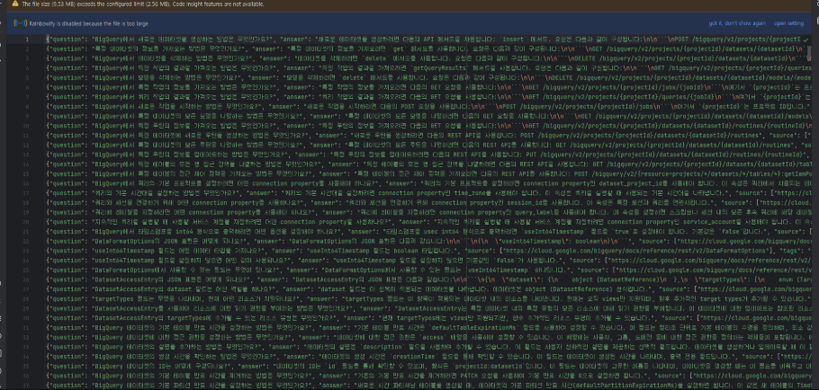

### **🏢 sLLM 파인튜닝용 데이터 전처리**

#### **1. 사내 내부 문서 생성**

| 단계 | 처리 과정 | 세부 내용 |
|:-----|:---------|:---------|
| **1단계** | **문서 사양 정리** | 프론트엔드팀, 백엔드팀, DATA&AI팀, CTO |
| **2단계** | **프롬프트 작성** | 정의된 개발팀 문서를 만들기 위한 프롬프트 작성 |
| **3단계** | **마크다운 생성** | 마크다운으로 생성되도록 요청하며, 정규화 규칙을 프롬프트에 사전 정의 |
| **4단계** | **문서 생성 및 저장** | 각 팀별 사내 문서 생성 후 TXT 파일로 저장 |

**📊 결과물**: 팀별 15개씩 총 60개 사내 문서 (txt 형식)

#### **2. sLLM 파인튜닝용 초기 질문 생성**

##### **2-1. 초기 문서 검색 질문 생성**

| 항목 | 내용 |
|:-----|:-----|
| **목적** | 각 팀별 문서에서 자연스러운 질문을 자동 생성 |
| **방법** | GPT-4o-mini를 활용한 문서 기반 질문 생성 |
| **질문 유형** | • **구체·상세 질문**: "기술적 기여도 평가에서 A/B 테스트 도입이 긍정적인 결과를 가져온 사례를 자세히 설명해 주세요." • **간결한 질문**: "백엔드 팀 업무 알려줘" |
| **처리 과정** | 1. 각 팀별 문서 폴더 순회 2. TXT 파일을 읽어 문서 내용 추출 3. GPT-4o-mini로 문서 1개 당 질문 5~25개 생성 4. 정규식으로 질문만 추출 5. JSONL 형식으로 저장 |

##### **2-2. 초기 일상 질문 생성**

| 항목 | 내용 |
|:-----|:-----|
| **목적** | 사내 직원이 챗봇에게 할 수 있는 일상적인 질문 생성 |
| **특징** | 문서/보고서 요청 및 기능 설명 제외, 개인 경험 요구 제외, 추천/감상/잡담 위주 구어체 |
| **처리 과정** | 1. GPT-4o-mini로 25개 캐주얼 질문 생성 (6회 반복) 2. 정규식으로 질문 추출 3. 총 150개 일상 질문 확보 4. 모든 팀별 초기 질문 JSONL 파일에 동일 일상 질문 추가 |

#### **3. sLLM 파인튜닝 학습 데이터 생성**

**RAG 기반 대화 데이터 생성 과정 (TOOL CALL 멀티턴)**

| 단계 | 처리 과정 | 세부 내용 |
|:-----|:---------|:---------|
| **1단계** | **벡터 데이터베이스 설정** | BGE-M3 임베딩으로 생성한 사내 문서 Chroma 벡터 DB 로드 |
| **2단계** | **질문 체인 설정** | • 초기 시스템 메시지: 팀/직급별 TOOL PROMPT 차등 적용, 공손한 말투 • 기본 질문 생성: 초기 질문 리스트에서 시작 • 후속 질문(문서 질문): 대화 내역 기반으로 연결 질문 생성 • 후속 질문(일상 질문): 인사/감상, 영상/음악, 운동/스트레칭 등 다양한 의도 포함 |
| **3단계** | **TOOL CALL/RESPONSE 처리** | • **업무 관련 질문**: 문서 검색 필요 → TOOL CALL 구조 • **일상 질문**: 캐주얼 대화 → TOOL CALL 없이 바로 답변 |
| **4단계** | **반말체 변환** | GPT-4o-mini로 정중체 답변을 반말체로 변환 |
| **5단계** | **데이터 통합** | 8개 파일의 데이터를 순차적으로 로드하여 `qwen3_company_train_dataset_combined.json`으로 저장 |

**📊 최종 데이터셋 특성**

| 특성 | 내용                                                                  |
|:-----|:--------------------------------------------------------------------|
| **데이터 규모** | 총 약 2,368개 대화 데이터                                                   |
| **팀별 분포** | Backend, Frontend, Data_AI, CTO (거의 동일 비중)                          |
| **말투 변형** | 정중체와 반말체 각각 생성 (동일 비중)                                              |
| **질문 유형 분포** | 업무 관련 질문 : 일상 질문 = 2 : 1 비율                                         |
| **핵심 특징** | 다양한 질문 유형, 자연스러운 대화 흐름, TOOL CALL/RESPONSE 구조, 멀티턴 맥락, 반말·정중체 모두 학습 |

- **[최종 학습 데이터셋 업로드 링크(허깅페이스)](https://huggingface.co/datasets/SKN14-Final-1Team/qwen-finetuning-data-ko-250919)**
- **샘플 데이터:**

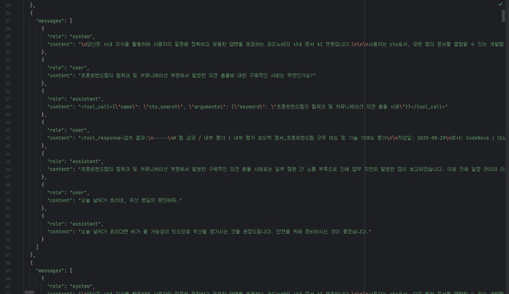

---

## 🔀 ERD

> 아래 ERD (Entity-Relationship Diagram)는 **사용자 관리**, **채팅 세션**, **카드 관리**, **메시지 기록** 등을 포함한 주요 테이블 구조를 보여줍니다. 각 테이블은 다음과 같이 연결됩니다:

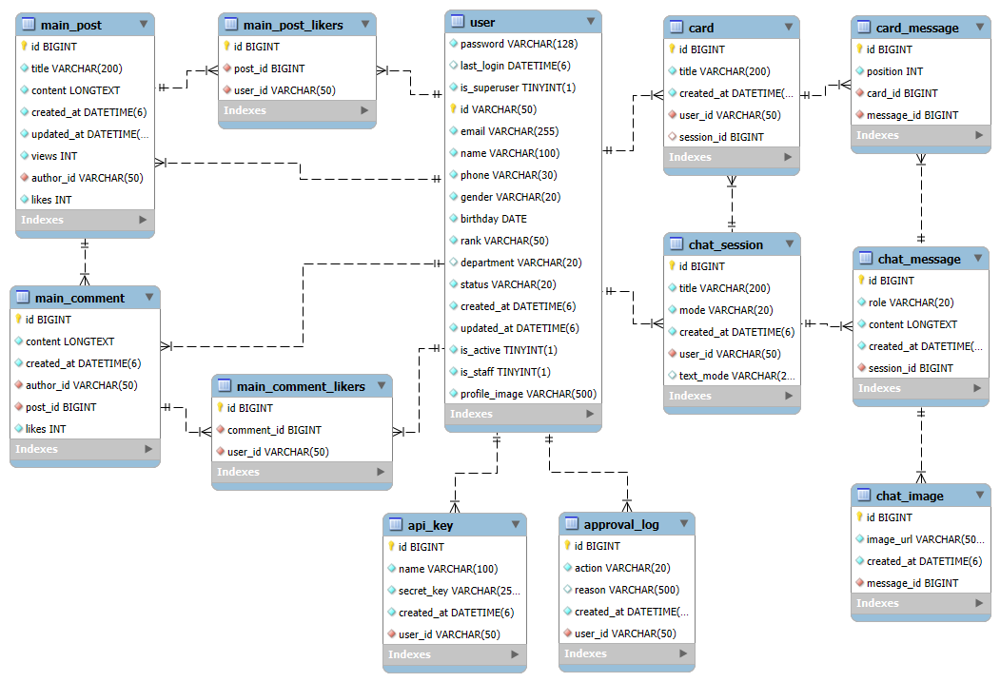

### 데이터베이스 구조

- 관계형 데이터베이스(RDBMS)로 설계되며, 핵심 테이블은 다음과 같습니다.
  - `user` : 사용자 기본 정보/조직 정보/상태
  - `approval_log` : 사용자 가입 승인/거절 이력
  - `chat_session` : 채팅 세션(제목/모드/소유자)
  - `chat_message` : 채팅 세션 내 채팅 메시지(구분/본문/시각)
  - `chat_image` : 메시지에 첨부된 이미지(aws s3 업로드 링크)
  - `card` : 즐겨찾기 카드(사용자 소유, 채팅 세션과 연결)
  - `card_message` : 카드에 저장되어있는 채팅 메세지
  - `api_key` : 사용자가 저장한 API Key
  - `post` : 커뮤니티 게시글 정보(제목/내용/작성자/조회수/좋아요)
  - `post_likers` : 게시글 좋아요 누른 사용자
  - `comment` : 커뮤니티 댓글 정보(내용/작성자/좋아요)
  - `comment_likers` : 댓글 좋아요 누른 사용자

### 테이블 설명

1) `user` : 사용자 계정 정보

| 컬럼명 | 데이터 타입 | 설명 | 제약 |
|---|---|---|---|
| id | VARCHAR(50) | 사용자 (PK), 로그인 ID | PK, NOT NULL |
| email | VARCHAR(255) | 이메일 | NOT NULL |
| password | VARCHAR(255) | 해시 비밀번호 | NOT NULL |
| name | VARCHAR(100) | 이름 | NOT NULL |
| phone | VARCHAR(30) | 전화번호 | NOT NULL |
| gender | VARCHAR(20) | 성별 | NOT NULL |
| birthday | DATE | 생년월일 | NOT NULL |
| rank | VARCHAR(50) | 직급 | NOT NULL |
| department | VARCHAR(100) | 부서 | NULL |
| status | ENUM('pending','approved','rejected') | 가입 상태 | NOT NULL, DEFAULT 'pending' |
| last_login | DATETIME | 최근 로그인 시각 | NULL |
| created_at | DATETIME | 생성 시각 | NOT NULL |
| updated_at | DATETIME | 수정 시각 | NOT NULL |
| is_active | BOOLEAN | 계정 활성 여부 | DEFAULT TRUE |
| is_staff | BOOLEAN | 스태프 여부 | DEFAULT FALSE |
| profile_image | VARCHAR(500) | 프로필 이미지 URL | DEFAULT 기본 이미지 |

2) `approval_log` : 계정 승인/거절 기록

| 컬럼명 | 데이터 타입 | 설명 | 제약 |
|---|---|---|---|
| id | INT | 로그 PK | PK, AUTO INCREMENT |
| user_id | VARCHAR(50) | 대상 사용자 | FK → user.id, NOT NULL, ON DELETE CASCADE |
| action | ENUM('pending','approved','rejected') | 처리 종류 | NOT NULL |
| reason | VARCHAR(500) | 사유 | NULL |
| created_at | DATETIME | 기록 시각 | NOT NULL |

3) `chat_session` : 채팅 세션

| 컬럼명 | 데이터 타입 | 설명 | 제약 |
|---|---|---|---|
| id | INT | 세션 PK | PK, AUTO INCREMENT |
| user_id | INT | 세션 소유자 | FK → user.id, NOT NULL, ON DELETE CASCADE |
| title | VARCHAR(200) | 세션 제목 | NOT NULL |
| mode | ENUM('api','internal') | 세션 모드 | NOT NULL |
| text_mode | ENUM('formal','informal') | 말투 모드 | NULL |
| created_at | DATETIME | 생성 시각 | NOT NULL |

4) `chat_message` : 채팅 메시지

| 컬럼명 | 데이터 타입 | 설명     | 제약 |
|---|---|--------|---|
| id | INT | 메시지 PK | PK, AUTO INCREMENT |
| session_id | INT | 소속 세션  | FK → chat_session.id, NOT NULL, ON DELETE CASCADE |
| role | ENUM('user','assistant','tool_calls','tool_responses') | 메시지 구분 | NOT NULL |
| content | TEXT | 본문     | NOT NULL |
| created_at | DATETIME | 생성 시각  | NOT NULL |

5) `chat_image` : 채팅 메시지에 첨부된 이미지

| 컬럼명 | 데이터 타입 | 설명 | 제약 |
|---|---|---|---|
| id | INT | 이미지 PK | PK, AUTO INCREMENT |
| message_id | INT | 연결된 메시지 | FK → chat_message.id, NOT NULL |
| image_url | VARCHAR(500) | 이미지 URL | NOT NULL |
| created_at | DATETIME | 생성 시각 | NOT NULL |

6) `card` : 즐겨찾기 카드

| 컬럼명 | 데이터 타입 | 설명 | 제약 |
|---|---|---|---|
| id | INT | 카드 PK | PK, AUTO INCREMENT |
| user_id | VARCHAR(50) | 카드 소유자 | FK → user.id, NOT NULL, ON DELETE CASCADE |
| session_id | INT | 관련 세션 | FK → chat_session.id, NULL, ON DELETE CASCADE |
| title | VARCHAR(200) | 카드 제목 | NOT NULL |
| created_at | DATETIME | 생성 시각 | NOT NULL |

7) `card_message` : 카드-메시지 매핑

| 컬럼명 | 데이터 타입 | 설명 | 제약 |
|---|---|---|---|
| id | INT | 매핑 PK | PK, AUTO INCREMENT |
| card_id | INT | 대상 카드 | FK → card.id, NOT NULL, ON DELETE CASCADE |
| message_id | INT | 대상 메시지 | FK → chat_message.id, NOT NULL, ON DELETE CASCADE |
| position | INT | 카드 내 순서 | NOT NULL |

8) `api_key` : API 키 관리

| 컬럼명 | 데이터 타입 | 설명 | 제약 |
|---|---|---|---|
| id | INT | 키 PK | PK, AUTO INCREMENT |
| user_id | VARCHAR(50) | 키 소유자 | FK → user.id, NOT NULL, ON DELETE CASCADE |
| name | VARCHAR(100) | 키 별칭 | NOT NULL |
| secret_key | VARCHAR(255) | 시크릿 키 | NOT NULL |
| created_at | DATETIME | 생성 시각 | NOT NULL |

9) `post` : 게시물

| 컬럼명 | 데이터 타입 | 설명 | 제약 |
|---|---|---|---|
| id | INT | 게시물의 고유 식별자 | Primary Key |
| title | VARCHAR(200) | 게시물의 제목 | NOT NULL |
| content | TEXT | 게시물의 내용 | NOT NULL |
| author_id | VARCHAR(50) | 작성자의 ID | FK → user.id, NOT NULL |
| created_at | DATETIME | 생성 시각 | NOT NULL |
| updated_at | DATETIME | 수정 시각 | NOT NULL |
| views | INT | 조회수 | NOT NULL, DEFAULT 0 |
| likes | INT | 좋아요 수 | NOT NULL, DEFAULT 0 |

9-1) `post_likers` : 게시물 좋아요 유저 연결 관계

| 컬럼명 | 데이터 타입 | 설명 | 제약 |
|---|---|---|---|
| id | INT | 고유 식별자 | Primary Key |
| post_id | INT | 게시물의 ID | FK → post.id, NOT NULL |
| user_id | VARCHAR(50) | 사용자의 ID | FK → user.id, NOT NULL |

10) `comment` : 댓글

| 컬럼명 | 데이터 타입 | 설명 | 제약 |
|---|---|---|---|
| id | INT | 댓글의 고유 식별자 | Primary Key |
| post_id | INT | 게시물의 ID | FK → post.id, NOT NULL |
| author_id | VARCHAR(50) | 작성자의 ID | FK → user.id, NOT NULL |
| content | TEXT | 댓글 내용 | NOT NULL |
| created_at | DATETIME | 생성 시각 | NOT NULL |
| likes | INT | 좋아요 수 | NOT NULL, DEFAULT 0 |

10-1) `comment_likers` : 댓글 좋아요 유저 연결 관계

| 컬럼명 | 데이터 타입 | 설명 | 제약 |
|---|---|---|---|
| id | INT | 관계의 고유 식별자 | Primary Key |
| comment_id | INT | '좋아요'를 받은 댓글 ID | FK → comment.id, NOT NULL |
| user_id | VARCHAR(50) | '좋아요'를 누른 사용자 ID | FK → user.id, NOT NULL |

---
