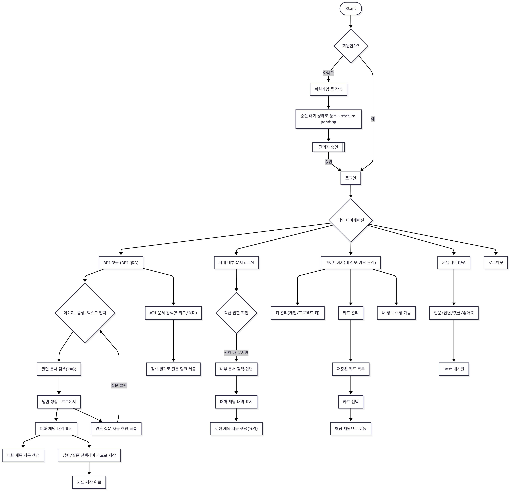

# 🚀 SK네트웍스 Family AI 과정 14기 1팀 - Final Project

## **❇️ 프로젝트명**  
LLM 활용 내부 고객 업무 효율성 향상을 위한 구글 API 전문 사내 개발자 지원 AI 기반 문서 검색 시스템  

---

## 🙌 팀원
- 김준기 · 김재우 · 안윤지 · 이나경 · 이원지희 · 정민영

---

## 📌 프로젝트 개요
구글 API는 방대한 문서와 복잡한 구조로 인해 개발자가 필요한 정보를 신속하게 찾기 어렵습니다.  

본 프로젝트는 **RAG + LLM 기반 문서 검색 시스템**을 구축하여 내부 개발자의 **검색 효율성**과 **업무 생산성**을 높이는 것을 목표로 합니다.  

이 시스템은 아래와 같이 크게 **구글 API 전문 어시스턴트**과 **사내 내부 문서 전문 sLLM 챗봇**으로 구성됩니다.  

- **구글 API 전문 어시스턴트**:  
  - **OpenAI GPT-4o 기반 메인 챗봇**
  > 구글 API Q&A, 예제 코드, 오류 해결 등 **구글 API 문서에 대한 전반적인 질의응답**을 지원하는 챗봇. 사용자가 질문을 입력하면 관련 문서를 벡터 DB에서 검색하여 최적의 답변을 제공합니다.  

  - **구글 API 문서 검색**:  
  >   **키워드 기반** 및 **의미 기반 검색**을 통해 구글 API 문서를 빠르게 찾을 수 있는 기능. 사용자가 특정 키워드나 의미를 입력하면 관련 원문 링크를 제공하여 구체적인 정보에 쉽게 접근할 수 있게 합니다.  

- **사내 내부 문서 전문 sLLM 챗봇**:  
  > 사내 정책·규정·기술 자료를 검색할 수 있으며, **권한 기반 보안 필터**를 적용해 사용자의 직급과 부서에 맞는 문서만 열람 가능  
  
  > 또한, **사내 전용 말투·용어·보고체계**를 반영하여 내부 직원들이 친숙하고 실질적인 도움을 받을 수 있도록 최적화된 대화 경험 제공  

---

## 📊 시장 조사 및 BM
### 시장 규모
- **글로벌 AI 소프트웨어 시장**: 2028년 6,788억 달러 전망  
- **국내 AI 산업**: 2024년 6조 3,000억 원 (응용 소프트웨어 2조 6,700억 원, 최대 비중)

### 타겟 고객
- 구글 API를 활용하는 **사내 개발자 / 엔지니어**
- 구글 API 서비스 및 연동 솔루션 관련 부서

### 비즈니스 모델 (BM)
- **구독형 라이선스**: 월/연 단위 과금, 기능별·사용자 수 차등 요금제
- **엔터프라이즈 계약**: 맞춤형 데이터 연동, 기술 지원 포함  

---

## ⚙️ 기술 스택

| 항목               | 내용                                                                                                                                                                                                                                                                                                                                                                                                                          |
| :----------------- |:------------------------------------------------------------------------------------------------------------------------------------------------------------------------------------------------------------------------------------------------------------------------------------------------------------------------------------------------------------------------------------------------------------------------------|
| **Frontend**       |     |
| **Backend**        |     |
| **DB**             |   |
| **Infra**          |    |
| **CI/CD**          |   |
| **Embedding**      |  |
| **LLM Model**      |   |
| **Collaboration**  |    |
| **Development**    |   |

---

## ⚙️ 시스템 아키텍처

> 본 시스템은 **Django** 기반 웹 애플리케이션과 여러 기능 모듈로 구성되며, **AWS Elastic Beanstalk** 환경에서 **Docker 컨테이너**로 배포됩니다. 
> 전체 구성은 **백엔드**(Django-Gunicorn/Uvicorn, FastAPI), **Chroma Vector DB**(챗봇 RAG 데이터 검색용), **MySQL**(사용자 및 콘텐츠 저장)로 이루어져 있습니다.

### [**아키텍쳐 이미지**]

### [**주요 구성 요소**]

#### 💠 **메인 챗봇 서비스**
- 구글 API 사용법 Q&A, 예제 코드, 오류 해결, 관련 질문 추천, 대화내역 카드 저장 기능을 제공.  
- **챗봇 호출**: **Django 서버** 내에서 **Gunicorn/Uvicorn**을 사용해 비동기 API 서버로 호출됩니다.

#### 💠 **사내 sLLM 챗봇**
- **FastAPI 서버**를 **RUNPOD** 환경에서 구축하여 호출됩니다. 이 챗봇은 **사내 정책 및 규정**에 대한 질의응답을 제공합니다.

#### 💠 **CI/CD**
- **GitHub Actions**와 **AWS Elastic Beanstalk**를 연동하여 **자동 배포** 파이프라인을 구축합니다.  
- GitHub Actions를 통해 코드 변경 시 자동으로 빌드하고 테스트한 후, **AWS Elastic Beanstalk**에 배포됩니다.

#### 💠 **백엔드 서버**
- **Gunicorn**과 **Uvicorn**을 병행하여 동기 요청 처리(Django 전통 요청)와 비동기 요청 처리(챗봇, API 호출 등)를 최적화합니다.

#### 💠 **데이터 저장 및 검색**
- **Chroma Vector DB**: 구글 API 문서 및 사내 문서 검색을 위한 **챗봇 RAG용 벡터 DB**.
- **MySQL**: 사용자 정보 및 콘텐츠 저장.

### 💠 **배포 및 운영**
- **Docker 컨테이너**를 활용하여 AWS에서 배포 및 운영되며, 각 기능 모듈이 분리되어 효율적으로 동작합니다.

---

## ✔️ 주요 기능

### **🌎 구글 API 전문 어시스턴트**
- **OpenAI GPT-4o 기반 메인 챗봇**:  
  > 구글 API Q&A, 예제 코드, 오류 해결 등 **구글 API 문서에 대한 전반적인 질의응답**을 지원하는 챗봇. 사용자가 질문을 입력하면 관련 문서를 벡터 DB에서 검색하여 최적의 답변을 제공합니다.  

- **구글 API 문서 검색**:  
  > **키워드 기반** 및 **의미 기반 검색**을 통해 구글 API 문서를 빠르게 찾을 수 있는 기능. 사용자가 특정 키워드나 의미를 입력하면 관련 원문 링크를 제공하여 구체적인 정보에 쉽게 접근할 수 있게 합니다.  

### **🧑‍💼 사내 문서 sLLM 챗봇**
- **내부 문서 검색 및 응답**:  
  > **사내 문서 검색**과 관련된 질문에 답변하는 챗봇으로, **직급 및 권한에 따른 문서 접근 제어**를 통해 보안이 강화된 검색 환경을 제공합니다. 또한, **사내 말투**와 **용어**를 반영하여, 조직 내부의 커뮤니케이션에 맞는 톤과 스타일로 응답합니다.  

---

### **⚙️ 부가기능**
- **대화 카드 저장**:  
  > 팀 내에서 중요한 **코드 자산**이나 **API 사용 예시** 등을 **대화 카드**로 저장하여, 향후 필요한 시점에 재활용이 가능하도록 합니다. 이 기능은 팀 내 지식 관리와 코드 자산의 공유를 촉진시켜 업무 효율성을 높입니다.  

- **API 키 관리**:  
  > API 키를 **저장, 수정, 삭제**할 수 있는 기능입니다. 사용자는 자신의 API 키를 저장하고 관리할 수 있습니다.

- **커뮤니티** (개발 후순위):  
  > 코드 예제, API 사용법, 문제 해결에 대한 **질의응답 커뮤니티** 기능을 제공합니다. 사용자는 자신이 겪은 문제나 궁금증을 커뮤니티에 게시하고, 다른 개발자들로부터 도움을 받을 수 있습니다. **고품질 게시글**은 벡터 DB에 주기적으로 업데이트되어, 챗봇이 향후 유사한 질문에 대해 더욱 정확하고 실용적인 답변을 제공할 수 있게 됩니다.

---

## ♒ 프로젝트 User-Flow

---

## 🧠 모델링 계획

### 1. **메인 챗봇 & RAG 시스템**
- **메인 챗봇**: **OpenAI GPT-4o** 모델을 기반으로 구글 API Q&A, 코드 예시, 오류 해결 등을 지원합니다.
- **RAG 시스템**: **Chroma Vector DB**를 사용하여 구글 API 문서와 관련된 데이터를 벡터화하여 검색 성능을 향상시킵니다.

####  <**QA셋 전처리 방식**>
- **청킹 및 페어 방식**: 문서 내 청킹(단락, 문장) 및 페어(청크 쌍) 방식으로 QA셋을 구성. 각 페어당 최대 5개 QA 생성.
- **기존 방식**: 한 문서 내 최대 10개 QA셋 생성.
- **QA셋 평가**: 핵심 포인트가 각 QA셋에 얼마나 반영되었는지 **GPT 모델**로 평가.
  - **반영됨**: 1점, **부분반영**: 0.5점, **누락됨**: 0점
  - **결과**: **95% 커버율** (기존 방식 75%)

#### <**성능 비교: QA셋 방식 vs 원문 데이터 방식**> (이후 비교 예정)
- **QA셋 방식**: 코드와 중요한 내용은 잘 보존할 수 있지만, 문서 전체 내용을 **커버하기 어려울 수 있습니다**. 청킹 및 페어 방식으로 **누락을 최소화**할 수 있지만, **문서의 전체 맥락**을 포괄하는 데 한계가 있을 수 있습니다.
- **원문 데이터 방식**: **문서 전체 내용**을 포함할 수 있어 맥락이 잘 유지되지만, **청킹 과정**에서 코드나 중요한 부분이 잘릴 수 있으며, 검색 성능이 떨어질 가능성도 있습니다.
- **향후 계획**: 두 가지 방식의 벡터 DB를 **개별적으로** 테스트하고, **두 방식 결합**을 통한 성능 비교 및 최적화도 진행할 예정입니다.

### <**지속적 개선 예정 사항**>
- **최신 api문서 크롤링을 주기적으로 진행하는 자동화 파이프라인 구축**을 통해서, api문서가 수정된 경우에도 rag 챗봇이 최신 문서 내용을 반영하여 답변할 수 있도록 개선
- **커뮤니티 고품질 답변**을 벡터 DB에 주기적으로 반영하여 챗봇 성능 지속 개선.

---
### 2. **사내 문서 sLLM (권한 기반 검색 + 파인튜닝 + Chroma Vector DB)**

<**모델**>: **QWEN 8B** 모델을 기반으로 사내 문서에 대한 질의응답 시스템을 구축합니다.  
  - **파인튜닝**: 사내 문서에 특화된 **멀티턴 데이터셋**을 생성하여 모델을 최적화하며, 사내의 고유한 문서 말투까지 모델이 학습하도록 합니다.

#### <**사내 문서 말투 학습 데이터 생성 프로세스**> (예상 프로세스로 설계 필요)
1. **문서 임베딩 및 벡터화**: 
   - 사내 문서를 임베딩하여 **벡터 DB**에 저장.  
   - 검색 기반 **RAG 환경** 구축을 위한 데이터 준비.

2. **질문 후보 생성**:  
   - **GPT-4**를 활용하여, 사내 문서를 순회하며 **실제 발생할 만한  질문**을 생성.

3. **1차 RAG 응답 생성**:  
   - 생성된 질문을 바탕으로 **벡터 DB**에서 **관련 컨텍스트**를 검색하고, **GPT-4**로 **첫 번째 답변**을 생성.

4. **멀티턴 질문 확장**:  
   - 첫 번째 질문/답변을 바탕으로 **연결 질문**을 **GPT-4**로 생성.
   - 이전 질문/답변/컨텍스트와 새 질문을 묶어 **2차 RAG 검색** 후 멀티턴 답변을 생성.

5. **대화형 데이터셋 구성**:  
   - **질문1 / CONTEXT1 / 답변1 / 질문2 / CONTEXT2 / 답변2** 형태로 **멀티턴 데이터셋** 구성.

6. **말투 적용**:  
   - **사내 문서의 말투**를 **프롬프트**에 반영하여 학습 데이터를 **실제 서비스 말투**로 변환.

#### <**RAG 기반 성능 최적화 예정**>
- **청킹된 사내 문서 벡터화 및 RAG 적용**: 원문을 **청킹하여 벡터 DB에 저장**하고, **RAG**로 컨텍스트를 제공하여 검색 성능을 최적화합니다.

---

## 📂 사용 데이터

- **외부 데이터**  
  - **Google API 공식 문서** (Drive, Sheets, Gmail, Maps, YouTube, Firebase, BigQuery 등 총 11개 API)  
    - **수집 방식**: 웹 크롤링 → 텍스트 추출 → 텍스트 파일 저장  
    - **내용**: 구글의 각종 API 공식 문서에서 필요한 데이터를 크롤링하여 수집. 각 문서의 구조와 내용에 맞춰 텍스트를 추출하고, 각 API 문서가 담고 있는 사용법, 예제 코드, 오류 해결법 등을 포함.  
    - **수집 데이터 양**: 약 2000개 문서 (txt 형식)

  - **Google API QA 문서**  
    - **수집 방식**: 구글 API 문서를 기반으로 Q&A 데이터셋 생성 (질문과 답변을 추출하여 JSONL 형식으로 저장)  
    - **내용**: 각 API 문서에서 중요한 정보나 사용자들이 자주 묻는 질문을 기반으로 **QA셋**을 생성. 이 데이터셋은 API 사용법, 오류 해결 방안 등을 중심으로 구성.  
    - **수집 데이터 양**: 아직 전체 문서에 대한 Q&A 데이터셋 생성 전 단계 (약 15000 ~ 20000개 정도의 QA셋이 생성될 것으로 예상)

- **내부 데이터**  
  - **사내 정책/규정 문서**  
    - **수집 방식**: OpenAI API 프롬프트 합성 → 텍스트 파일 저장  
    - **내용**: 사내 정책, 규정, 기술 매뉴얼 등 사내 문서들을 프롬프트 합성을 통해 생성하여 수집. 각 직급별(사원, 대리, 과장, 부장, 사장)로 문서 구조와 내용이 달라지며, 이를 바탕으로 텍스트 파일을 생성.  
    - **수집 데이터 양**: 직급별로 10개씩 총 50개 문서 (txt 형식)

---

## 🔀 ERD
> 아래 **ERD (Entity-Relationship Diagram)**는 **사용자 관리**, **채팅 세션**, **카드 관리**, **메시지 기록** 등을 포함한 주요 테이블 구조를 보여줍니다. 각 테이블은 다음과 같이 연결됩니다:

- **User**: 시스템의 사용자 정보를 관리하며, **API Key**, **Card**, **Chat Session**, **Approval Log**와 연결됩니다.
  - **user_id**를 기준으로 여러 엔티티와 관계를 형성합니다.
  
- **API Key**: 사용자의 **API 키** 정보를 저장합니다.
  - **user_id**를 통해 **User**와 연결됩니다.

- **Card**: 사용자 카드 정보를 저장하며, **Card Message**와 연결되어 카드 내 메시지를 관리합니다.
  - **user_id**와 **session_id**를 통해 사용자 및 세션과 연결됩니다.

- **Chat Session**: 각 사용자별로 생성되는 **채팅 세션**을 저장하며, **Chat Message**와 연결됩니다.
  - **user_id**와 **session_id**로 **User**와 **Card** 테이블과 연관됩니다.

- **Chat Message**: **채팅 메시지**를 저장하며, **Chat Session**과 연결됩니다.

- **Card Message**: 각 카드 내에서 발생하는 메시지 정보를 관리하며, **Card**와 연결됩니다.

- **Approval Log**: 시스템 내 **승인 로그**를 기록하며, **User**와 연결됩니다.

---

## 👥 역할 분담 (R&R)

| 구분 | 담당자 | 역할 |
|------|--------|------|
| **총괄** | 김준기 | 프로젝트 리드, 서비스 배포 |
| **데이터 수집** | 김준기, 이원지희, 이나경, 안윤지, 정민영, 김재우 | API별 문서 수집 및 정제 |
| **AI 백엔드** | 이나경, 안윤지, 정민영 | API문서 RAG 기반 LLM 개발 |
|  | 김준기, 이원지희, 김재우 | 사내 문서 sLLM 개발 |
| **웹 개발(Django)** | (페이지별 추후 배정) | 인증/회원가입/챗봇 UI |
| **서비스 배포** | 김준기, 정민영 | AWS, Docker, Nginx, CI/CD |

---

## 🚧 향후 계획

### **✔️ 기술 검증 및 기반 구축**
- **RAG + sLLM을 위한 FastAPI 설계**: RAG와 sLLM을 효과적으로 통합하여 API 서버를 구축합니다.
- **Qwen Finetuning 방법 조사**: **Qwen 8B 모델**에 대해 최적화 및 파인튜닝 방법을 조사하고 적용합니다.
- **벡터 DB 성능 평가**: **QA data**와 **원문 data**를 비교 분석하여 벡터 DB의 검색 성능을 평가하고 최적화합니다.
- **RAG 평가 방법 구축**: RAG 기반 성능 평가를 위한 정확한 기준과 방법을 설계합니다.

### **✔️ 모델 최적화 및 기능 개발**
- **LLM 프롬프트 최적화 및 성능 평가**: LLM 프롬프트를 최적화하여 모델 성능을 극대화하고 평가합니다.
- **Django 웹 UI 및 챗봇 인터페이스 구축**: 사용자 인터페이스 및 챗봇 인터페이스를 개발하여 사용자 경험을 향상시킵니다.
- **내부 sLLM 권한 필터링 적용**: 권한 기반으로 sLLM 챗봇의 문서 검색과 응답을 강화하여 보안성을 높입니다.

### **✔️ 서비스 고도화 및 배포**
- **사용자 기능 구현**: 사용자 피드백을 바탕으로 기능을 개선하고, 사용자 맞춤형 서비스를 제공할 수 있도록 합니다.
- **AWS + Docker 기반 배포**: AWS와 Docker 환경에서 안정적이고 확장 가능한 서비스를 배포합니다.
- **운영 환경에서의 안정화 및 성능 개선**: 배포된 시스템의 안정성과 성능을 지속적으로 모니터링하고 최적화합니다.

### **✔️ CI/CD 구축**
- GitHub Actions를 사용하여 **CI/CD 파이프라인을 자동화**하고, 코드를 **AWS Elastic Beanstalk**에 배포합니다.
- GitHub Actions는 코드를 푸시할 때마다 자동으로 빌드하고 테스트한 후, **AWS Elastic Beanstalk**에 자동 배포를 실행하여 **빠르고 안전한 배포**를 보장합니다.

---
